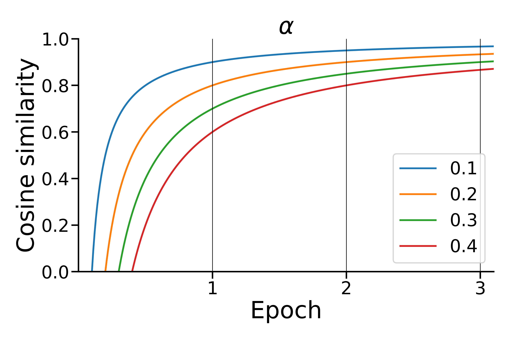

Guide
=====

.. image:: https://img.shields.io/pypi/v/boostsa.svg
        :target: https://pypi.python.org/pypi/prosit

.. image:: https://img.shields.io/github/license/fornaciari/boostsa
        :target: https://lbesson.mit-license.org/
        :alt: License

.. image:: https://github.com/fornaciari/boostsa/workflows/Python%20Package/badge.svg
        :target: https://github.com/fornaciari/prosit/actions

.. image:: https://readthedocs.org/projects/boostsa/badge/?version=latest
        :target: https://boostsa.readthedocs.io/en/latest/?badge=latest
        :alt: Documentation Status

.. image:: https://colab.research.google.com/assets/colab-badge.svg
    :target: https://colab.research.google.com/drive/1eewGMqW_cIRqKdWW1tBCFE3T2qVCI_EV#scrollTo=6czDoYOiGpJx
    :alt: Open In Colab

Intro
-----

ProSiT - PROgressive SImilarity Thresholds is an algorithm for topic models.
Given a corpus of texts, it will find latent dimensions corresponding
to the main topics present in the corpus, providing for each of them the relative keywords (descriptors).

It is input agnostic: it can deal with any kind of textual representations, be they vectors resulting from, for example,
Bag of Words - BoW or State Of The Art - SOTA (multi-lingual) Language Models - LMs.

ProSiT is deterministic and fully interpretable.

It does not require any assumption regarding the possible number of topics in a corpus of documents:
they are automatically identified given two tunable similarity parameters, :math:`\alpha` and :math:`\beta`.

The :math:`\alpha` parameter is used to determine the minimum Cosine Similarity Threshold - CST to consider different documents
as related to the same latent dimension, i.e. topic.
PRoSiT is an iterative algorithm, that finds these latent dimensions in different epochs,
where the overall number of data points is progressively reduced, as step by step each set of points lying within the given threshold is
collapsed into its centroid.
In this procedure, growing cosine similarity thresholds are needed to prevent all the data points
from falling into their global centroid.
Therefore, the :math:`\alpha` parameter is used in the following formula, that provides higher CSTs at every epoch:

.. math::

    CST = \frac{iter - \alpha}{iter}

This produce this kind of curves,:

Epoch by epoch, reducing the number of data points into smaller sets of latent dimensions, ProSiT produces several hypotheses
of groups of topics/latent dimensions.
To extract from them their main keywords, for each latent dimension we need to determine which documents we want to consider.
To this aim we use the parameter :math:`\beta`, which represent the percentage of the documents,
the most close to the latent dimension, that will be considered.
For example, :math:`\beta = .1` means that, considering the closest documents to the topic, the top 10% will be taken into consideration.
In practice, :math:`\beta` affects the level of specificity that will be considered as satisfying, for each set of descriptors.

